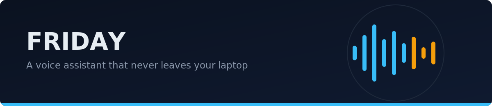
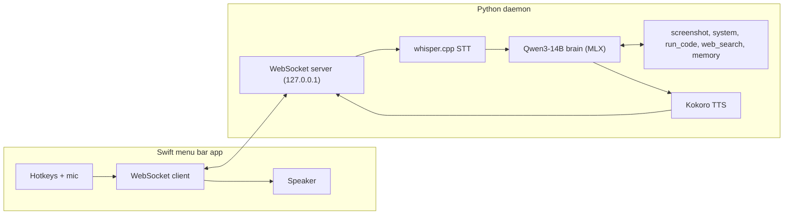

<p align="center"></p>

<p align="center">
  
</p>

Speech in, answer spoken back, tools in between. Everything runs on the
laptop: no cloud, no API keys, works with WiFi off.

## Motivation

I wanted an assistant I could talk to without streaming audio of my life to
a data center. Everything FRIDAY hears, thinks, and says stays on my
machine. Underneath that is the engineering question I actually cared
about: how much assistant fits in 24 GB of laptop memory, and how fast can
it feel?

## Measured

Qwen3-14B (4-bit) on an Apple M5, against a llama.cpp baseline serving the
same model class. Greedy decoding, fixed 128-token generations, medians of
3 runs. Raw output is committed in [benchmarks/results/](benchmarks/results/).

<p align="center"></p>

| | 1 stream | 4 streams | 8 streams | TTFT p50 | Peak memory |
|---|---|---|---|---|---|
| **FRIDAY** | 14.2 tok/s | 39.7 | **42.2** | 0.33 s | 8.8 GB |
| llama.cpp | 13.2 tok/s | 30.4 | 32.6 | 0.27 s | 11.7 GB |

Continuous batching is the win: 3x FRIDAY's own single-stream rate at 8
concurrent streams, 1.3x llama.cpp's aggregate. llama.cpp is slightly
faster to first token. Caveats (quantization schemes and memory accounting
differ per runtime) are in [benchmarks/](benchmarks/).

## How it works



Three decisions carry the experience:

- **Speak while thinking.** Tokens stream out of the model, get cut at
  sentence boundaries, and each sentence is synthesized immediately, so
  audio starts before the answer is finished.
- **Read the screen cheaply.** Screen questions go through Apple's native
  OCR plus the frontmost window title (about 100 ms, near-zero memory). A
  vision model is loaded only for truly visual questions, then freed.
- **One model, two frontends.** The voice daemon and an HTTP API share the
  model. The API does continuous batching: a scheduler thread owns the MLX
  engine, admits new requests at token boundaries, streams each response,
  and sheds load with a 503 when full.

## Run it

Apple Silicon, Python 3.11, Xcode command line tools.

```bash
git clone https://github.com/rohanramachandran/friday && cd friday
./scripts/setup.sh   # venv, deps, ~12 GB of model downloads
./scripts/run.sh     # voice daemon on ws://127.0.0.1:8765
```

Then `python scripts/cli.py` in another terminal to talk from the
terminal, or build the menu bar app ([docs/app-setup.md](docs/app-setup.md)).
The HTTP API is `./scripts/serve.sh`:

```bash
curl -N http://127.0.0.1:8080/generate \
  -H 'Content-Type: application/json' \
  -d '{"prompt": "What is a limit order book?", "max_tokens": 128}'
```

Tests (no model downloads needed): `pip install pytest && pytest tests/`

## Limitations

- macOS and Apple Silicon only, by design: MLX, Apple Vision, AppleScript
- The code tool runs Python in a subprocess with a timeout, not a sandbox
- Web search scrapes DuckDuckGo and can break when the page changes
- Wake-word listening transcribes a rolling window; simple, costs battery
