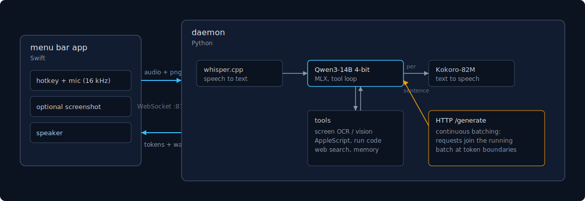
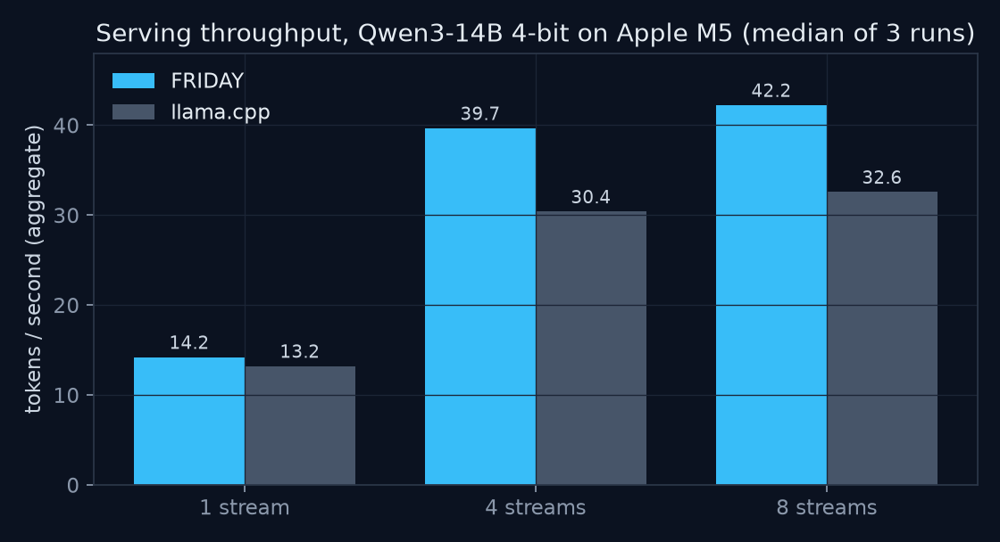

# FRIDAY


FRIDAY is a voice assistant that runs entirely on a Mac. Speech recognition,
the language model, tool execution, and speech synthesis all happen locally.
It works with WiFi off.

## Why I built it

Partly privacy: I did not want a microphone that streams to a data center.
Mostly to answer a concrete question: how capable an assistant fits in 24 GB
of laptop memory, and what it takes to make local inference feel fast in a
conversation.

## How it works



A Swift menu bar app captures push-to-talk audio, optionally with a
screenshot, and talks to a Python daemon over a local WebSocket. The daemon
transcribes with whisper.cpp, generates with Qwen3-14B under MLX, and
synthesizes speech with Kokoro. During generation the model can call tools:
screen reading, AppleScript system control, Python execution, web search,
and search over past conversations.

Two decisions carry most of the perceived speed:

- Speech starts before generation finishes. The token stream is cut at
  sentence boundaries and each sentence is synthesized immediately.
- Screen questions avoid the vision model when possible. Apple's OCR plus
  the active window title answers most of them in about 100 ms. A vision
  model is loaded only for questions about images or layout, then freed.

The same model is also served over HTTP (`scripts/serve.sh`). The server
does continuous batching: a scheduler thread owns the MLX engine, joins new
requests into the running batch at token boundaries, and streams each
response. Disconnecting cancels a request; a full queue returns 503.

## Benchmarks

Qwen3-14B 4-bit on an M5 MacBook, fixed 128-token greedy generations,
medians of three runs. Baseline: llama.cpp build 10050 serving the same
model as Q4_K_M. Raw output is committed in
[benchmarks/results/](benchmarks/results/).



| | 1 stream | 4 streams | 8 streams | first token p50 | peak memory |
|---|---|---|---|---|---|
| FRIDAY | 14.2 tok/s | 39.7 | 42.2 | 0.33 s | 8.8 GB |
| llama.cpp | 13.2 tok/s | 30.4 | 32.6 | 0.27 s | 11.7 GB |

Batching is where the gap opens: at eight concurrent streams FRIDAY reaches
1.3x llama.cpp's aggregate throughput. Single-stream decode is within a few
percent and llama.cpp reaches first token sooner. The two runtimes use
different 4-bit quantization schemes and different memory accounting;
details in [benchmarks/](benchmarks/).

## Setup

Apple Silicon, Python 3.11, Xcode command line tools.

```bash
git clone https://github.com/rohanramachandran/friday && cd friday
./scripts/setup.sh    # venv, dependencies, ~12 GB of model downloads
./scripts/run.sh      # daemon on ws://127.0.0.1:8765
python scripts/cli.py # talk from the terminal
```

Building the menu bar app: [docs/app-setup.md](docs/app-setup.md).

Tests need no models: `pip install pytest && pytest tests/`

## Limitations

- macOS and Apple Silicon only: the stack is MLX, Apple Vision, AppleScript.
- The code tool runs Python in a subprocess with a timeout, not a sandbox.
- Web search scrapes DuckDuckGo and breaks when the page layout changes.
- Wake-word listening transcribes a rolling audio window, which is simple
  but costs battery.
